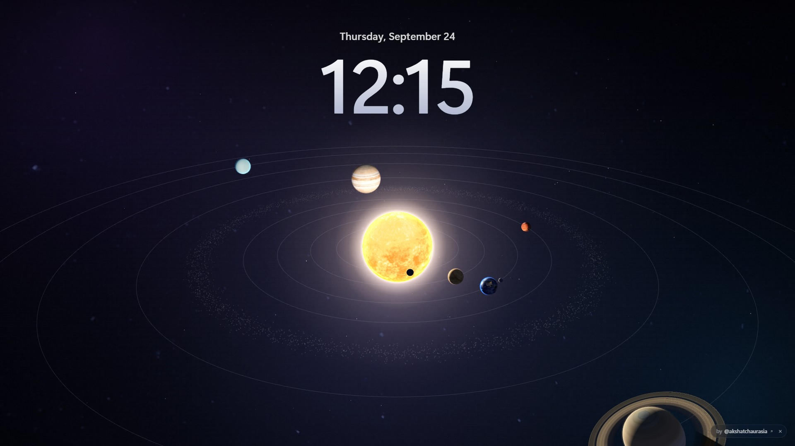
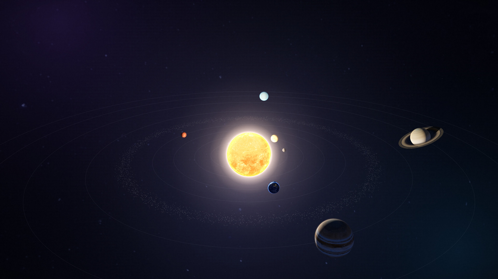
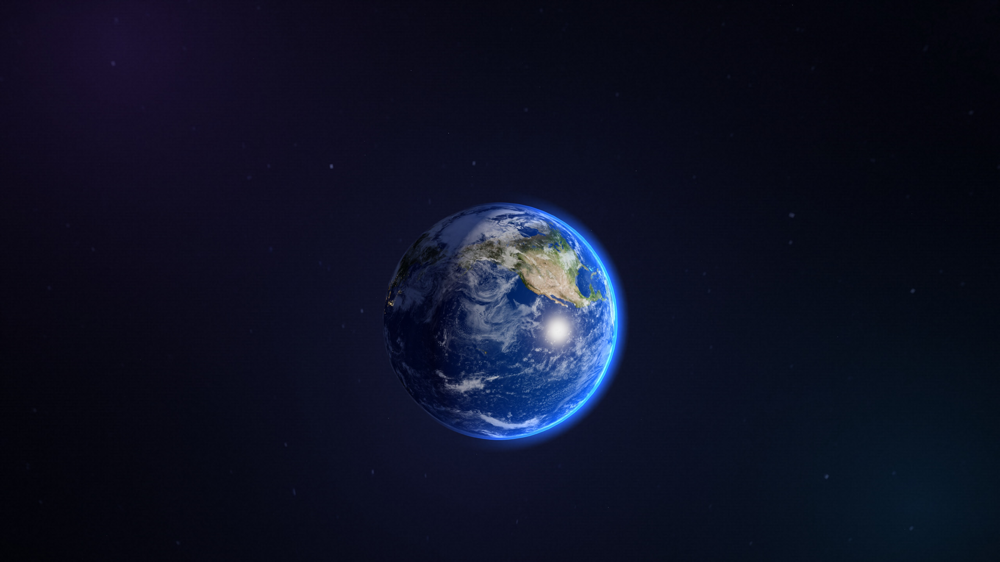
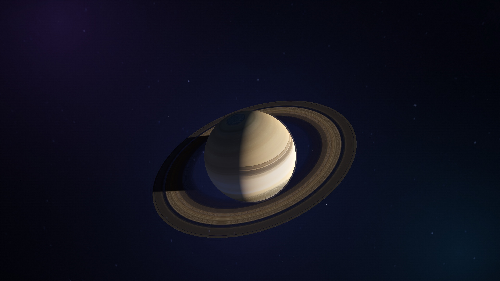
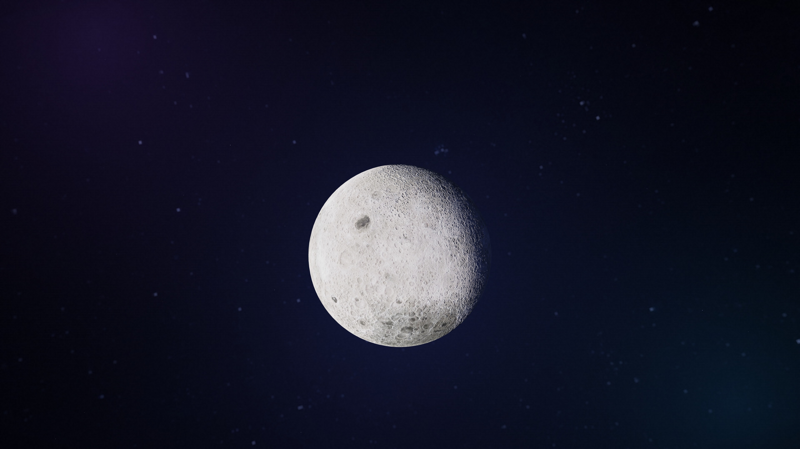

# Solar System — Live Wallpaper 
If you like this project, consider giving it a Star

A calm, Apple-style 3D solar system for your desktop, with a live lock-screen clock.
Click any planet to explore it, or keep just one planet as your wallpaper.

**Made by [@akshatchaurasia](https://linktr.ee/akshatchaurasia)**

---

## What you get

- All 8 planets, the Sun and the Moon, slowly orbiting in real 3D
- Big lock-screen style clock and date
- Real textures: Earth's clouds and city lights, Saturn's ring shadows, the Moon's craters
- Click a planet for a glassy info card with real facts
- Keep a single planet as your wallpaper; it's remembered after a restart
- Light on your PC: runs at 30 fps and pauses completely when the desktop is covered

## How to use it

| Do this | What happens |
|---|---|
| **Click** a planet | Zooms in and shows its info card |
| **Click** the same planet again | Back to the full solar system |
| **Double-click** a planet | Close-up: only that planet stays, everything else fades away |
| **Double-click + drag** (hold the second click and move) | Rotate the orbit up, down, left and right |
| **Double-click** empty space | Back to the normal view after rotating |
| **Drag** in a planet close-up | Turn around that planet |
| **Scroll** | Zoom in and out |
| **–** on the info card | Hide the card and keep this planet as your wallpaper |
| **Esc** | Step back |

A short guide appears once, the first time you use it.

---

## Install

> Windows and Mac use the **same files**; you don't need a separate version for each.

### Windows: Lively Wallpaper (free, recommended)

1. Install **[Lively Wallpaper](https://www.rocksdanister.com/lively/)**. It's free, and also on the Microsoft Store.
2. Download **`SolarSystem-Wallpaper.zip`** from the **[Releases page](../../releases/latest)**.
3. Open Lively, click **+ Add Wallpaper**, and choose the zip (or drag the zip onto the Lively window).
4. Click the new *Solar System* wallpaper to apply it.
5. To click planets on your desktop, go to Lively **Settings → Wallpaper → Wallpaper Input** and set it to **Mouse**.

**Tip:** in Lively, click the wallpaper's **⋯ → Customise** to change the frame rate, quality, 24-hour clock, orbit lines and more.

> Use the zip from **Releases**, not GitHub's green "Code → Download ZIP" button. That one puts everything inside an extra folder, which Lively doesn't accept.

### Windows: Wallpaper Engine (paid, on Steam)

1. Download this repository and unzip it.
2. Open Wallpaper Engine and click **Create Wallpaper** (bottom left).
3. Choose **`index.html`** from the unzipped folder, then save it.

### Mac: Plash (free)

macOS can't play live wallpapers by itself, but the free **[Plash](https://sindresorhus.com/plash)** app can show a website as your desktop.

1. Install **Plash** from the Mac App Store.
2. Click the Plash icon in the menu bar → **Add Website**, and paste:
   `https://YOUR-USERNAME.github.io/YOUR-REPO/`
3. To click planets, turn on **Browsing Mode** in Plash's menu.

### Any computer: 4K still wallpapers (no app needed)

Windows Settings and macOS System Settings can only use **images**, not live wallpapers.
So there are ready-made 4K images in the **[`wallpapers`](wallpapers)** folder:

| Solar System | Earth | Saturn | Moon |
|---|---|---|---|
|  |  |  |  |

- **Windows:** right-click an image → **Set as desktop background**
- **Mac:** **System Settings → Wallpaper → Add Photo**, and pick an image

### Just try it in your browser

Open **https://YOUR-USERNAME.github.io/YOUR-REPO/** and press **F11** (Windows) or
**Ctrl + Cmd + F** (Mac) for full screen.

---

## Questions

**Can I set it directly in Windows Settings as a live wallpaper?**
No. Windows only supports still images and slideshows there. For the live version use Lively
(free); for Settings use the 4K images above.

**Do I need a different version for Mac?**
No. The same wallpaper works on both. Mac just uses Plash instead of Lively.

**Will it slow down my PC?**
It's built to be light: 30 fps while idle, and it stops completely when a window covers the
desktop. You can lower it even more in Lively's Customise panel ("Battery saver").

---

## Socials

Find me everywhere: **[linktr.ee/akshatchaurasia](https://linktr.ee/akshatchaurasia)**

## Credits

- 3D engine: [three.js](https://threejs.org) (MIT License)
- Planet, Moon, Sun and star textures: [Solar System Scope](https://www.solarsystemscope.com/textures/) (CC BY 4.0)

## License

© 2026 Akshat Chaurasia. **Free for personal use.** Please don't modify, re-upload, sell or remove
the credit without permission. See [LICENSE](LICENSE) for the details.
